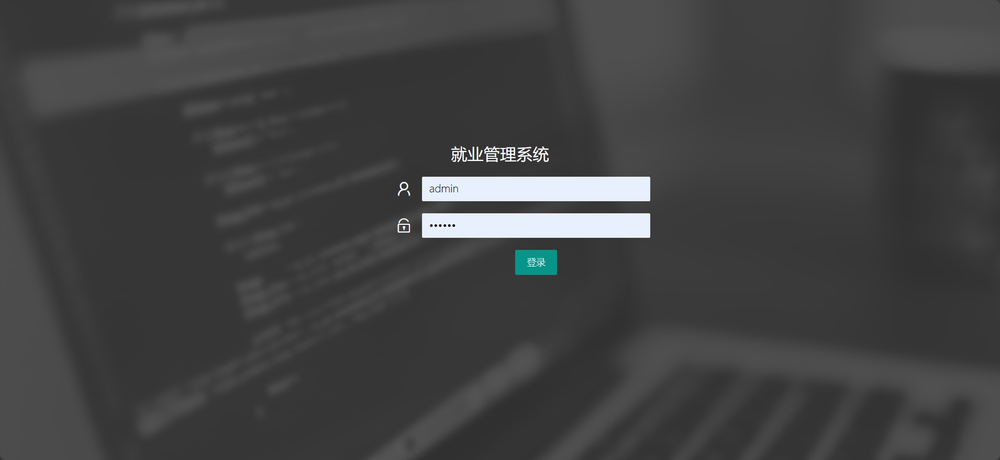
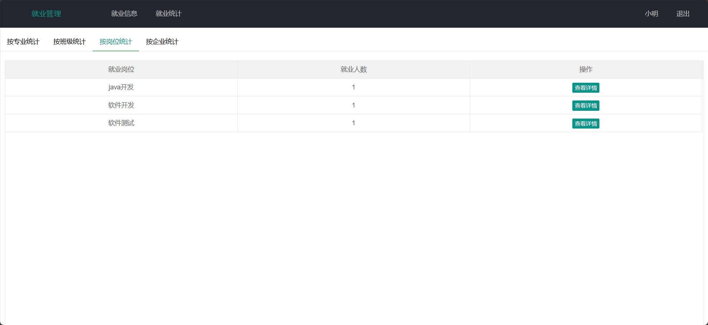
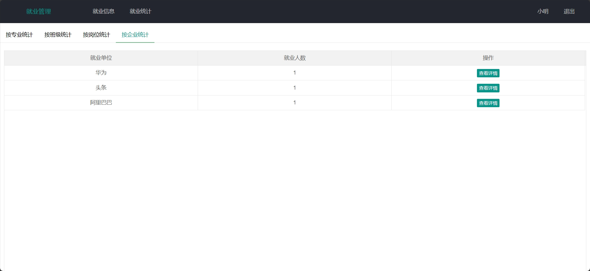
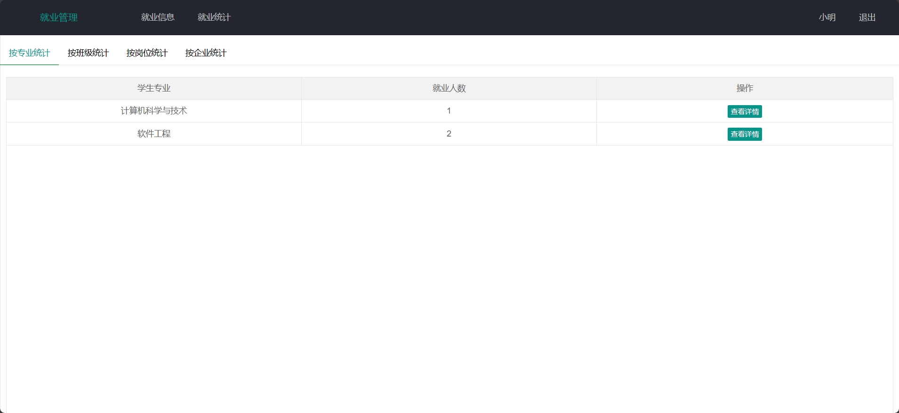
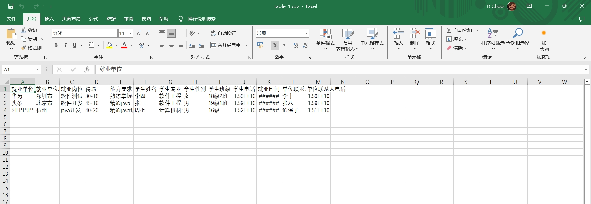
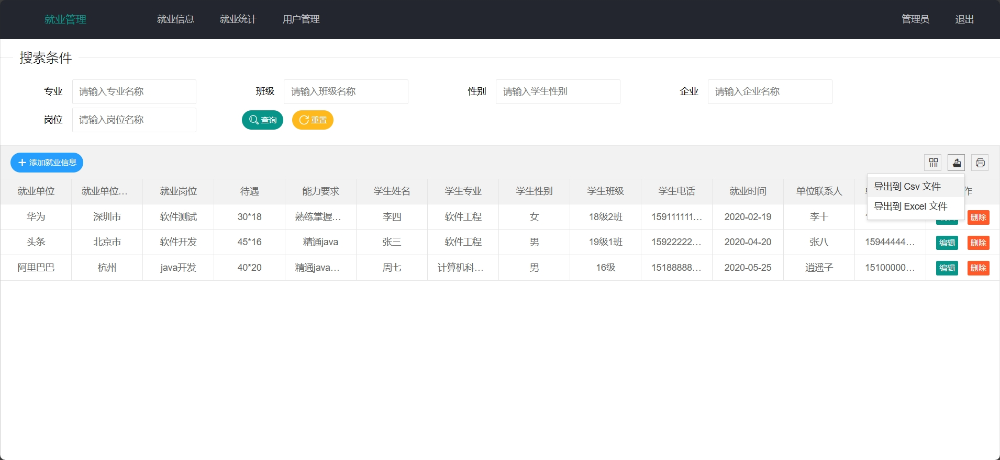

<h1 align="center">基于SSM框架的就业管理系统</h1>

 获取sql文件 QQ: 3645296857 QQ群: 978300347 

<b> 需要视频演示可联系上述QQ，私发视频链接 </b>

 [个人站点: mzoo源码网](https://mzoocodes.com/)

## 简介

> 本代码来源于网络,仅供学习参考使用!
>
> 提供1.远程部署/2.修改代码/3.设计文档指导/4.框架代码讲解等服务
>
> 前端首页: http://localhost:8080/
>
> 管理员登录地址：http://localhost:8080/
>
> 管理员: admin 密码: 123456
>
> 用户登录地址：http://localhost:8080/
>
> 用户: 001 密码: 123456
> 

## 项目介绍

基于SSM框架的就业管理系统：前端 LayUI、JQuery、Ajax、Html，后端 SpringMVC、Mybatis，系统角色分为：管理员和用户，管理员在管理后台录入就业信息，对就业数据进行统计和导出，也可以对系统中的用户信息进行录入，用户根据信息筛选就业信息，可以对数据进行导出和打印；主要功能如下：

### 管理员：

- 基本操作：登录、获取个人信息
- 就业信息模块：添加就业信息、编辑就业信息、删除就业信息、筛选就业信息、获取就业信息列表、查看就业信息详情、导出就业信息、打印就业信息
- 就业统计模块：按专业统计就业信息、按岗位统计就业信息、按班级统计就业信息、按企业统计就业信息
- 用户管理模块：添加用户、筛选用户、获取用户列表、查看用户详情、编辑用户信息、删除用户、导出用户信息、打印用户信息

### 用户：

- 基本操作：登录、获取个人信息
- 就业信息模块：筛选就业信息、获取就业信息列表、查看就业信息详情、导出就业信息、打印就业信息
- 就业统计模块：按专业统计就业信息、按岗位统计就业信息、按班级统计就业信息、按企业统计就业信息

## 环境

- <b>IntelliJ IDEA 2020.3</b>

- <b>Mysql 5.7.26</b>

- <b>Tomcat 8.0.32</b>

- <b>Maven 3.6.3</b>

- <b>JDK 1.8</b>

## 运行截图

